  

# Picture Perfect Projects 321

A conversion-focused landing page package for local painting offers, fast quote capture, and mobile-first contact flows.

  <code>Quote Capture</code> <code>Direct Response</code> <code>Mobile First</code> <code>Static Site</code> <code>Cloudflare Ready</code>

## What this repo contains

- Offer pages for neighborhood and discount campaigns
- Quote form capture and thank-you flow
- Direct call, text, and email response paths
- Static publishing helpers for fast deployment

## File map

- `index.html`: primary landing page
- `discount/` and `discountoffer/`: campaign-specific surfaces
- `thank-you/`: post-submit flow
- `publish.ps1`: publishing helper
- `DEPLOY.md`: deployment notes
- `assets/`: images and static media

## Stack

- HTML
- CSS
- JavaScript
- Cloudflare Pages oriented deployment

## Local preview

Open `index.html` locally or deploy as a static site using the included publishing helpers.
